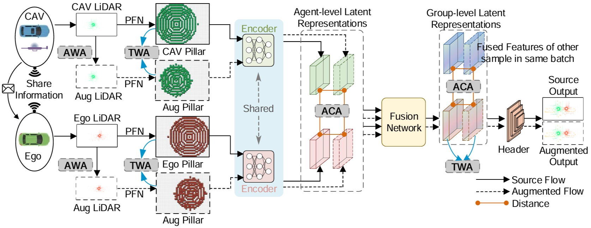

# V2X-DGW: Domain Generalization for Multi-agent Perception under Adverse Weather Conditions
[](https://arxiv.org/pdf/2403.11371)


This is the official implementation of ICRA2025 paper. "V2X-DGW: Domain Generalization for Multi-agent Perception under Adverse Weather Conditions".


<p align="center">

</p>

## Data and Checkpoint Download

[link](https://csuohio-my.sharepoint.com/:u:/g/personal/2883754_vikes_csuohio_edu/IQAjsTKlS-C1QY1trdqJFI3fAbiGlzztMoMPNcQX27kx7yk?e=6IY16M) to download the opv2v-w data.

[link](https://csuohio-my.sharepoint.com/:u:/g/personal/2883754_vikes_csuohio_edu/IQA6uWw7Y4wsT4O9VCMA41prAZ7iwxceOsXsQNJXadzDAPY?e=b6xAde) to download the v2xset-w data.

[link](https://csuohio-my.sharepoint.com/:u:/g/personal/2883754_vikes_csuohio_edu/IQCRo9j1fO6gT6WtiqywCC5xAS0ex5JVEvORNN4SE8EKaPw?e=abD6xW) to download the checkpoint.


## Devkit setup and Quick Start

Please refer to V2V4Real, our code are mainly based on this repo [V2V4Real](https://github.com/ucla-mobility/V2V4Real).


## Citation
```shell
@INPROCEEDINGS{11127945,
  author={Li, Baolu and Li, Jinlong and Liu, Xinyu and Xu, Runsheng and Tu, Zhengzhong and Guo, Jiacheng and Zou, Qin and Li, Xiaopeng and Yu, Hongkai},
  booktitle={2025 IEEE International Conference on Robotics and Automation (ICRA)}, 
  title={V2X-DGW: Domain Generalization for Multi-Agent Perception Under Adverse Weather Conditions}, 
  year={2025},
  volume={},
  number={},
  pages={974-980},
  keywords={Representation learning;Point cloud compression;Degradation;Three-dimensional displays;Rain;Snow;Object detection;Robotics and automation;Vehicle-to-everything;Meteorology},
  doi={10.1109/ICRA55743.2025.11127945}}
```
